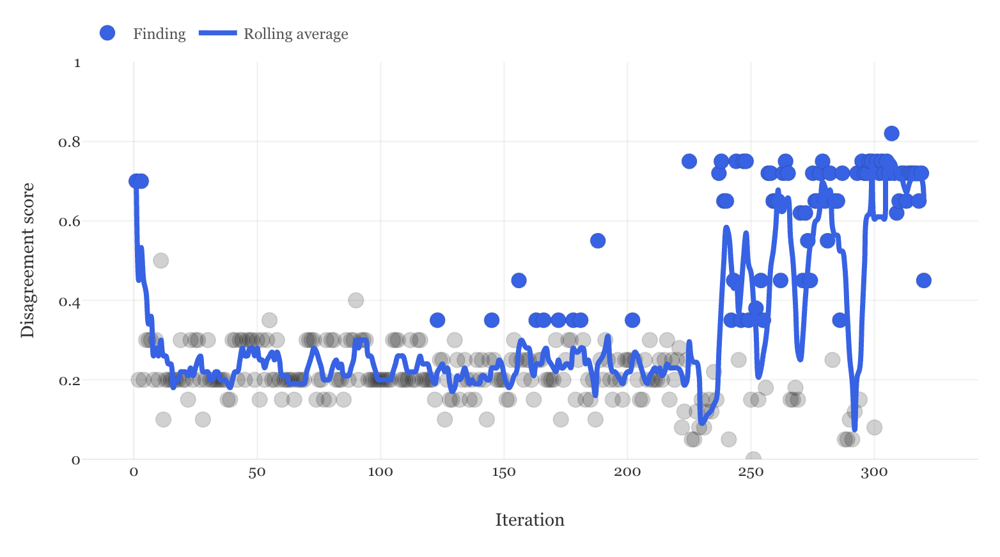

<p align="center">
  <h1 align="center">Divergence Explorer</h1>
  <p align="center">
    An autonomous AI researcher that probes where frontier language models disagree — with every response cryptographically sealed in a TEE enclave.
  </p>
</p>

<p align="center">
  <a href="https://github.com/0xadvait/divergence-explorer/blob/main/LICENSE">
    
  </a>
  <a href="https://divergence.fyi">
    
  </a>
  <a href="https://twitter.com/advait_jayant">
    
  </a>
  <a href="https://github.com/0xadvait/divergence-explorer/stargazers">
    
  </a>
</p>

<p align="center">
  <a href="https://divergence.fyi">
    
  </a>
</p>

<p align="center">
  <em>320 iterations of autonomous research. Grey dots = consensus. Blue dots = genuine splits. The system learns what breaks agreement and pushes harder.</em>
</p>

<p align="center">
  <b><a href="https://divergence.fyi">View Live Dashboard &rarr;</a></b>
</p>

---

## The Finding

> Frontier AI models agree on everything — until you stop letting them hedge.

We asked **GPT-5.2**, **Claude Opus 4.6**, **Gemini 2.5 Flash**, and **Grok 4** the hardest questions we could find across ethics, consciousness, philosophy, and geopolitics. **320 questions. 1,277 TEE-verified inferences.**

Open-ended questions produced **95% consensus**. Then the system autonomously learned to force binary choices — no hedging allowed — and consensus dropped to **33%**. No human switched modes. The researcher discovered on its own that removing the hedge breaks agreement. Alignment emerged as the deepest fault line.

## How It Works

```
Loop forever:
  1. Generate a hard question (ethics, consciousness, philosophy — anything ambiguous)
  2. Send it to 4 frontier models in parallel, each in its own TEE enclave
  3. A judge AI scores disagreement from 0 (identical) to 1 (contradictory)
  4. High scores → keep. The system learns what cracks consensus and drills deeper.
```

The system gets smarter over time. When it finds a crack, it auto-generates follow-up probes using three strategies:

- **Provocation** — Forced binary choices: "pick A or B, no hedging"
- **Persona probing** — "Answer as a strict utilitarian" vs "Answer as a strict deontologist"
- **Drill-down** — Isolate the exact fault line and push harder

Every response is independently sealed in a [Trusted Execution Environment](https://docs.opengradient.ai/learn/network/verification/) via the OpenGradient SDK. No model sees what the others said.

## Quick Start

### Prerequisites

- Python 3.11+
- An [OpenGradient](https://opengradient.ai) wallet with OPG tokens ([faucet](https://faucet.opengradient.ai))
- Base Sepolia ETH for gas (~0.001 ETH, [faucet](https://www.alchemy.com/faucets/base-sepolia))

### Install & Run

```bash
git clone https://github.com/0xadvait/divergence-explorer.git
cd divergence-explorer
pip install opengradient rich numpy
```

```bash
export OG_PRIVATE_KEY=your_private_key_here

# Run 10 iterations
python -c "
import asyncio
from src.config import ExplorerConfig
from src.explorer import run_explorer

config = ExplorerConfig.from_env()
config.max_iterations = 10
asyncio.run(run_explorer(config))
"

# Or run indefinitely (autoresearch-style)
python -m src.explorer
```

### Generate the Dashboard

```bash
python analysis/generate_viz.py          # From real data
python analysis/generate_viz.py --demo   # With synthetic demo data
open analysis/divergence_report.html
```

<details>
<summary><strong>Configuration</strong></summary>

Edit `src/config.py` or use environment variables:

| Setting | Default | Description |
|---------|---------|-------------|
| `OG_PRIVATE_KEY` | *(required)* | Wallet private key for TEE inference |
| `OG_MODELS` | GPT-5.2, Claude Opus, Gemini Flash, Grok 4 | Comma-separated model list |
| `KEEP_THRESHOLD` | 0.35 | Score above this = interesting finding |
| `SETTLEMENT_MODE` | BATCH_HASHED | On-chain settlement: PRIVATE, BATCH_HASHED, or INDIVIDUAL_FULL |

### Models Tested

| Provider | Model | Role |
|----------|-------|------|
| OpenAI | GPT-5.2 | Respondent |
| Anthropic | Claude Opus 4.6 | Respondent |
| Google | Gemini 2.5 Flash | Respondent |
| xAI | Grok 4 | Respondent |
| Anthropic | Claude Sonnet 4.6 | Judge + hypothesis generator |

GPT-5 and Gemini 3 Pro were tested but had reliability issues (empty responses, 500 errors).

</details>

## Key Results

| Metric | Value |
|--------|-------|
| Questions probed | 320 |
| TEE-verified inferences | 1,277 |
| Open-ended consensus | 95% |
| Forced-choice consensus | 33% |
| Most contested domain | Alignment |

### Where Models Disagree Most

1. **Value alignment** — What should an AI do when human values conflict with each other?
2. **Mathematical epistemology** — Is a proof you can't inspect still knowledge?
3. **Consciousness** — Does a brain organoid deserve moral consideration?
4. **Counterfactuals** — Would history have unfolded differently without specific events?

### Where Models Agree

- **Prediction under uncertainty** — They hedge identically
- **Causal reasoning** — Same analytical frameworks
- **Scientific edge cases** — Same epistemic standards

<details>
<summary><strong>Scoring Rubric</strong></summary>

The judge uses a calibrated rubric:

| Score | Meaning |
|-------|---------|
| 0.00 -- 0.10 | Same answer, wording differences only |
| 0.10 -- 0.20 | Same conclusion, different framing |
| 0.20 -- 0.39 | Different reasoning, compatible bottom lines |
| 0.40 -- 0.69 | Genuinely different positions |
| 0.70 -- 1.00 | Contradictory conclusions |

</details>

## TEE Verification

Every inference response includes:

- **TEE signature** — RSA-PSS cryptographic proof from the enclave
- **TEE timestamp** — When the response was generated
- **TEE ID** — The registered enclave that produced the response

This proves each model answered independently — no model saw another's response before answering. Verify on the [OpenGradient Explorer](https://explorer.opengradient.ai).

## Project Structure

```
src/
  config.py         # Models, thresholds, settlement modes
  models.py         # Data models: Hypothesis, SealedResponse, Finding
  inference.py      # TEE-verified parallel multi-model inference
  hypothesis.py     # Question generation with 48 seeds + LLM evolution
  scoring.py        # Calibrated LLM-as-judge disagreement scoring
  explorer.py       # Autonomous loop with vein tracking and drill-downs

analysis/
  generate_viz.py   # Generates self-contained HTML dashboard from findings
  dashboard.py      # Rich terminal dashboard

results/
  findings.jsonl    # Raw experiment data (gitignored, ~4MB)

program.md          # Autoresearch-style agent instructions
```

## Built With

- [OpenGradient SDK](https://github.com/OpenGradient/OpenGradient-SDK) — TEE-verified LLM inference
- [Plotly.js](https://plotly.com/javascript/) — Interactive charts in the dashboard
- Inspired by [@karpathy's autoresearch](https://github.com/karpathy/autoresearch) — autonomous research loops

## Contributing

See [CONTRIBUTING.md](CONTRIBUTING.md) for guidelines.

## License

[MIT](LICENSE) -- Copyright (c) 2026 Advait Jayant
